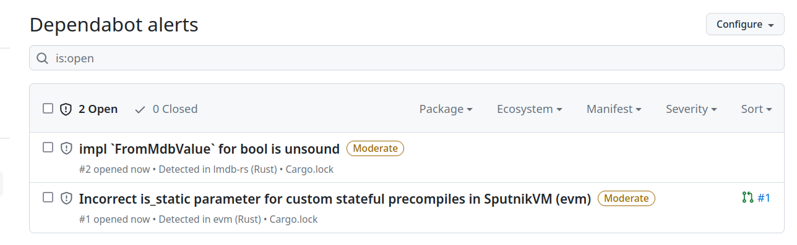

# vulnerable_crate

This crate is intended for testing purposes only, and uses vulnerable dependencies on purpose.
Its goal is to allow checking and comparing outputs of various auditing tools
able to work on Rust sources or binaries.

## Vulnerabilities

This crate includes different cases in its dependencies:

* An `informational = "notice"` [advisory](https://rustsec.org/advisories/RUSTSEC-2022-0058.html)
* An `informational = "unsound"` [advisory](https://rustsec.org/advisories/RUSTSEC-2023-0047.html)
* An `informational = "unmaintained"` [advisory](https://rustsec.org/advisories/RUSTSEC-2023-0040.html)
* A non-informational [advisory](https://rustsec.org/advisories/RUSTSEC-2022-0083.html)
* A withdrawn `informational = "unmaintained"` [advisory](https://rustsec.org/advisories/RUSTSEC-2021-0147.html)

## Audit outputs

Note: For binary audits mentioned below, the binary needs to be built with:

```shell
cargo install cargo-auditable
# to audit production code
cargo auditable build --release
```

### cargo-deny

Informational advisories are considered as warnings by default, and non-informational advisories are treated as errors.
Users can pass `--deny/--allow/--warn` flags to change the behavior on specific advisory types.

Note: notice advisories appear as `warning[notice]` (and not as a "note" output type that also exists in `cargo-deny`).

```shell
$ cargo install cargo-deny
# Ignore other checks
$ cargo deny check advisories
warning[unsound]: impl `FromMdbValue` for bool is unsound
   ┌─ /home/amousset/projects/vulnerable_crate/Cargo.lock:40:1
   │
40 │ lmdb-rs 0.7.6 registry+https://github.com/rust-lang/crates.io-index
   │ ------------------------------------------------------------------- unsound advisory detected
   │
   = ID: RUSTSEC-2023-0047
   = Advisory: https://rustsec.org/advisories/RUSTSEC-2023-0047
   = The implementation of `FromMdbValue` have [...]
   = Announcement: https://github.com/vhbit/lmdb-rs/issues/67
   = Solution: No safe upgrade is available!
   = lmdb-rs v0.7.6
     └── vulnerable_crate v0.1.0

warning[unmaintained]: `users` crate is unmaintained
   ┌─ /home/amousset/projects/vulnerable_crate/Cargo.lock:77:1
   │
77 │ users 0.11.0 registry+https://github.com/rust-lang/crates.io-index
   │ ------------------------------------------------------------------ unmaintained advisory detected
   │
   = ID: RUSTSEC-2023-0040
   = Advisory: https://rustsec.org/advisories/RUSTSEC-2023-0040
   = The `users` crate hasn't seen any [...]
   = Announcement: https://github.com/ogham/rust-users/issues/54
   = Solution: No safe upgrade is available!
   = users v0.11.0
     └── vulnerable_crate v0.1.0

warning[notice]: Library exclusively intended to inject UB into safe Rust.
   ┌─ /home/amousset/projects/vulnerable_crate/Cargo.lock:35:1
   │
35 │ inconceivable 0.9.0 registry+https://github.com/rust-lang/crates.io-index
   │ ------------------------------------------------------------------------- notice advisory detected
   │
   = ID: RUSTSEC-2022-0058
   = Advisory: https://rustsec.org/advisories/RUSTSEC-2022-0058
   = Quoting from the crate description [...]
   = Announcement: https://crates.io/crates/inconceivable
   = Solution: No safe upgrade is available!
   = inconceivable v0.9.0
     └── vulnerable_crate v0.1.0

error[vulnerability]: evm incorrect state transition
   ┌─ /home/amousset/projects/vulnerable_crate/Cargo.lock:20:1
   │
20 │ evm 0.35.0 registry+https://github.com/rust-lang/crates.io-index
   │ ---------------------------------------------------------------- security vulnerability detected
   │
   = ID: RUSTSEC-2022-0083
   = Advisory: https://rustsec.org/advisories/RUSTSEC-2022-0083
   = SputnikVM, also called evm, [...]
   = Announcement: https://github.com/rust-blockchain/evm/pull/133
   = Solution: Upgrade to >=0.36.0 (try `cargo update -p evm`)
   = evm v0.35.0
     └── vulnerable_crate v0.1.0

advisories FAILED
```

### cargo-audit

Informational advisories are considered as warnings by default, and non-informational advisories are treated as errors.
Users can pass a `--deny` flag to treat some warnings as errors.

```shell
$ cargo install cargo-audit
$ cargo audit
❯ cargo audit
    Fetching advisory database from `https://github.com/RustSec/advisory-db.git`
      Loaded 559 security advisories (from /home/amousset/.cargo/advisory-db)
    Updating crates.io index
    Scanning Cargo.lock for vulnerabilities (87 crate dependencies)
Crate:     evm
Version:   0.35.0
Title:     evm incorrect state transition
Date:      2022-10-25
ID:        RUSTSEC-2022-0083
URL:       https://rustsec.org/advisories/RUSTSEC-2022-0083
Severity:  7.5 (high)
Solution:  Upgrade to >=0.36.0
Dependency tree:
evm 0.35.0
└── vulnerable_crate 0.1.0

Crate:     inconceivable
Version:   0.9.0
Warning:   notice
Title:     Library exclusively intended to inject UB into safe Rust.
Date:      2022-09-28
ID:        RUSTSEC-2022-0058
URL:       https://rustsec.org/advisories/RUSTSEC-2022-0058
Dependency tree:
inconceivable 0.9.0
└── vulnerable_crate 0.1.0

Crate:     users
Version:   0.11.0
Warning:   unmaintained
Title:     `users` crate is unmaintained
Date:      2023-06-01
ID:        RUSTSEC-2023-0040
URL:       https://rustsec.org/advisories/RUSTSEC-2023-0040
Dependency tree:
users 0.11.0
└── vulnerable_crate 0.1.0

Crate:     lmdb-rs
Version:   0.7.6
Warning:   unsound
Title:     impl `FromMdbValue` for bool is unsound
Date:      2023-06-26
ID:        RUSTSEC-2023-0047
URL:       https://rustsec.org/advisories/RUSTSEC-2023-0047
Dependency tree:
lmdb-rs 0.7.6
└── vulnerable_crate 0.1.0

error: 1 vulnerability found!
warning: 3 allowed warnings found
```

The binary file audit returns the exact same output.

```shell
cargo audit bin target/release/vulnerable_crate
```

### osv-scanner

OSV scanner uses osv.dev and finds advisories from both GitHub and RustSec databases.

```shell
$ osv-scanner .
Scanning dir .
Scanning /home/amousset/projects/vulnerable_crate/ at commit 00d2c0647947737aa8303dc98d4ea22295e593ec
Scanned /home/amousset/projects/vulnerable_crate/Cargo.lock file and found 87 packages
╭─────────────────────────────────────┬──────┬───────────┬───────────────┬─────────┬────────────╮
│ OSV URL                             │ CVSS │ ECOSYSTEM │ PACKAGE       │ VERSION │ SOURCE     │
├─────────────────────────────────────┼──────┼───────────┼───────────────┼─────────┼────────────┤
│ https://osv.dev/GHSA-hhc4-47rh-cr34 │ 5.9, │ crates.io │ evm           │ 0.35.0  │ Cargo.lock │
│ https://osv.dev/RUSTSEC-2022-0083   │ 7.5  │           │               │         │            │
│ https://osv.dev/RUSTSEC-2022-0058   │      │ crates.io │ inconceivable │ 0.9.0   │ Cargo.lock │
│ https://osv.dev/GHSA-f9g6-fp84-fv92 │      │ crates.io │ lmdb-rs       │ 0.7.6   │ Cargo.lock │
│ https://osv.dev/RUSTSEC-2023-0047   │      │           │               │         │            │
│ https://osv.dev/RUSTSEC-2023-0040   │      │ crates.io │ users         │ 0.11.0  │ Cargo.lock │
╰─────────────────────────────────────┴──────┴───────────┴───────────────┴─────────┴────────────╯
```

### GitHub Advisories / Dependabot / etc.

It looks like:

* Non-informational advisories are imported
  * e.g.: https://github.com/advisories/GHSA-hhc4-47rh-cr34
* `informational = "unsound"` advisories are imported
  * e.g.: https://github.com/advisories/GHSA-f9g6-fp84-fv92
* `informational = "unmaintained" / "notice"` are not imported (and hence not reported as vulnerabilities)

Which results in:

* Reported alerts on the repository:



* A pull request from _dependabot_: https://github.com/amousset/vulnerable_crate/pull/1

### Trivy

This shows the same output as the GitHub tooling, i.e., only vulnerabilities and unsoundness advisories.

Note: This is because their OSV import [only imports GHSA advisories now](https://github.com/aquasecurity/trivy-db/blob/15ce04b6527c7c14bee72d0bd100653a8450bf3a/pkg/vulnsrc/osv/osv.go#L38).

```shell
$ trivy fs .
2023-08-19T16:31:38.396+0200	INFO	Vulnerability scanning is enabled
[...]
2023-08-19T16:31:38.456+0200	INFO	Detecting cargo vulnerabilities...

Cargo.lock (cargo)

Total: 2 (UNKNOWN: 0, LOW: 0, MEDIUM: 2, HIGH: 0, CRITICAL: 0)

┌─────────┬─────────────────────┬──────────┬──────────┬───────────────────┬───────────────┬───────────────────────────────────────────────────┐
│ Library │    Vulnerability    │ Severity │  Status  │ Installed Version │ Fixed Version │                       Title                       │
├─────────┼─────────────────────┼──────────┼──────────┼───────────────────┼───────────────┼───────────────────────────────────────────────────┤
│ evm     │ CVE-2022-39354      │ MEDIUM   │ fixed    │ 0.35.0            │ 0.36.0        │ Incorrect is_static parameter for custom stateful │
│         │                     │          │          │                   │               │ precompiles in SputnikVM (evm)                    │
│         │                     │          │          │                   │               │ https://avd.aquasec.com/nvd/cve-2022-39354        │
├─────────┼─────────────────────┤          ├──────────┼───────────────────┼───────────────┼───────────────────────────────────────────────────┤
│ lmdb-rs │ GHSA-f9g6-fp84-fv92 │          │ affected │ 0.7.6             │               │ impl `FromMdbValue` for bool is unsound           │
│         │                     │          │          │                   │               │ https://github.com/advisories/GHSA-f9g6-fp84-fv92 │
└─────────┴─────────────────────┴──────────┴──────────┴───────────────────┴───────────────┴───────────────────────────────────────────────────┘
```

### Grype

Same as GitHub tooling, plus a false positive on the `ethereum` name, confused with
a vulnerability in a C++ implementation

```shell
$ grype .
 ✔ Vulnerability DB                [no update available]  
 ✔ Indexed file system                                                                                                                                                                     .
 ✔ Cataloged packages              [87 packages]  
 ✔ Scanned for vulnerabilities     [3 vulnerabilities]  
   ├── 1 critical, 0 high, 2 medium, 0 low, 0 negligible
   └── 1 fixed
[0000]  WARN no explicit name and version provided for directory source, deriving artifact ID from the given path (which is not ideal) from-lib=syft
NAME      INSTALLED  FIXED-IN  TYPE        VULNERABILITY        SEVERITY 
ethereum  0.12.0               rust-crate  CVE-2017-14451       Critical  
evm       0.35.0     0.36.0    rust-crate  GHSA-hhc4-47rh-cr34  Medium    
lmdb-rs   0.7.6                rust-crate  GHSA-f9g6-fp84-fv92  Medium
```